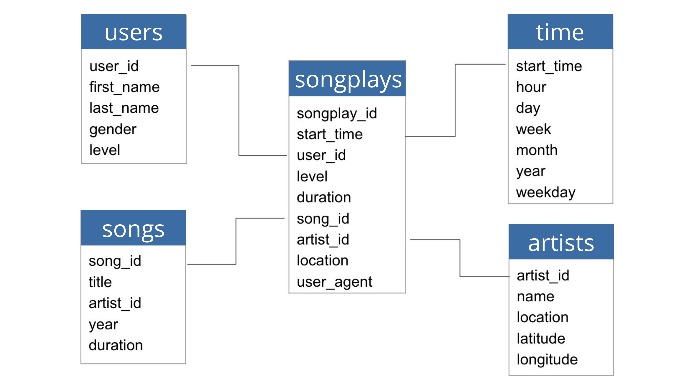

# Data Warehouse com Redshift

## Introdução

Esse é um projeto para praticar a construção de um data warehouse com Redshift e desenvolvimento de dashboards com Metabase.

Esse projeto ajuda o time de analytics da startup de streaming de música chamada Sparkify, analisando seus dados de músicas e atividades de usuários.

Definindo um star chema e escrevendo o pipeline ETL, os dados armazenados em um bucket do S3 serão transferidos para um data warehouse na cloud para possíveis análises futuras. 

## Data Schema and ETL Pipeline

### Data Schema

Sparkify deseja analisar quais músicas os seus usários estão escutando.

Utilizando os conjuntos de dados songs e logs, foi criado um star schema como mostrado abaixo, que inclui

- Uma tabela fato: **songplays**, e 
- Quatro tabelas dimensões: **users**, **songs**, **artists** and **time**.

### ETL Pipeline

O ETL pipeline extrai os dados dos arquivos `song_data.json` e `log_data.json` do S3, faz a inserção nas tabelas da `stage area` e em seguida faz a carga nas tabelas fatos e dimensões do `Redshift` utilizando o script `etl.py`, como você pode observar na imagem abaixo

## Como executar

### Pré-requisitos

Se você deseja executar esse projeto, você deve finalizar os seguintes passos primeiro.

- Crar um novo usuário IAM na sua conta AWS
- Fornecer acessos admnistrativos
- Use a chave de acesso e a chave secreta para criar os clientes para o EC2, S3, IAM e Redshift
- Criar um IAM Role que faça com que o Redshift tenha acesso S3 bucket (ReadOnly)
- Criar um cluster do Redshift e pegar o DWH_ENDPOIN(Host address) e DWH_ROLE_ARN e preencher o arquivo config
- Instalar `Metabase`

### Instruções

1. Criar database/tablelas: `python create_tables.py`
2. Enviar os os arquivos JSON do bucket S3 para stage area e carregar as tabelas dimensões e fato no Redshift: `python etl.py`
3. Confira o resultado do processo: Execute as queries, individualmente, do arquivo `test.sql` para visualizar se os dados foram registrados corretamente nas tabelas.
4. Dashboard

## Arquivos do projeto

- **data**
  - **log_data**
    - dados de ações dos usuários no app (Ex: Quais músicas eles estão escutando)
  - **song_data**
    - dados sobre as músicas e os artistas
- **images**
  - Imagens do documento
- **create_tables.py**
  - Quando executado, esse script irá
    - `drop` database `sparkifydb`
    - `create` database `sparkifydb`
    - `drop` tables if exists
    - `create` tables if not exists
- **etl.py**
  - Esse script irá executar as queries que extrai os arquivos JSON do bucket S3 carregando-os no Redshift
- **README.md**
  - Descrição e instruções sobre o projeto
- **sql_queries.py**
  - Contém todas instruções DLL definidas
- **test.sql**
  - Queries para testar se as tabelas foram populadas corretamente
- **dhw.cfg**
  - Arquivo de configuração que contem informações sobre o Redshift, IAM e S3
- **arquivo do metabase**
  - Dashboard com as análises realizadas.
